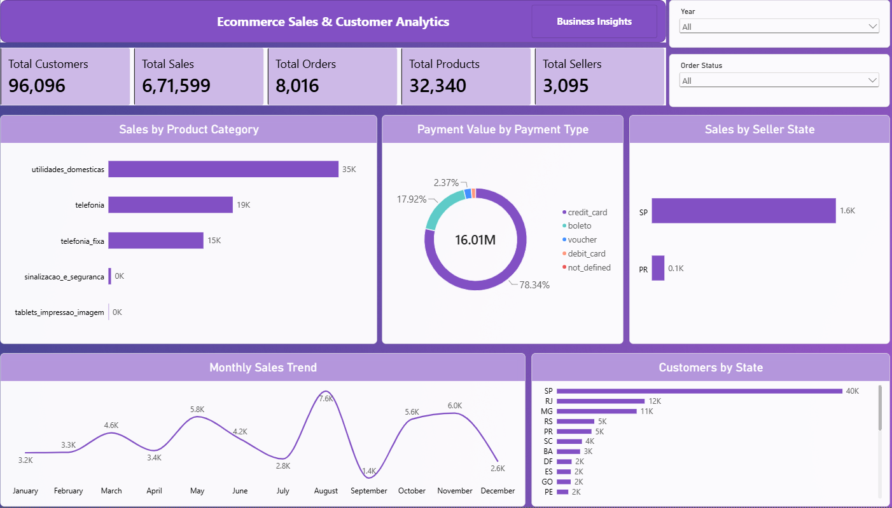

# E-commerce Sales & Customer Analytics

## 📊 Project Overview

This project analyzes e-commerce sales and customer data using Power BI.

The dashboard provides insights into sales performance, customers, orders, products, sellers, payment methods, product categories, and customer distribution across states.

## 🛠️ Tools & Technologies

- Power BI
- Power Query
- DAX
- Excel

## 📌 Key Metrics

- Total Customers: 96,096
- Total Sales: 671,599
- Total Orders: 8,016
- Total Products: 32,340
- Total Sellers: 3,095
- Payment Value: 16.01M

## 🔍 Dashboard Analysis

The dashboard analyzes:

- Sales by Product Category
- Payment Value by Payment Type
- Sales by Seller State
- Monthly Sales Trend
- Customers by State
- Order Status
- Year-wise performance

## 📈 Key Observations

- `utilidades_domesticas` is the highest-selling product category shown in the dashboard.
- São Paulo (SP) has the highest seller sales among the states displayed.
- Credit card is the dominant payment type by payment value.
- São Paulo also has the highest number of customers among the states displayed.
- Monthly sales show noticeable variation throughout the year, with August showing one of the highest monthly values.

## 📷 Dashboard Preview

## 💡 Skills Demonstrated

- Data Cleaning
- Data Transformation
- Data Analysis
- Data Visualization
- Power Query
- DAX
- Dashboard Development
- Business Insights
